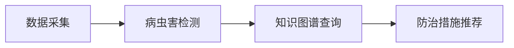

随着农业智能化的不断推进，基于知识图谱的病虫害检测和防治推荐系统已成为农业技术的重要一环。本文将介绍如何使用知识图谱构建一个智能化病虫害检测及防治推荐系统，具体包括系统架构、数据处理、知识图谱构建及查询实现等技术细节。


<center style="color:#C0C0C0">图1.植物病害</center>

## 1. 系统架构

本系统主要分为以下几个模块：

- 数据采集模块：通过传感器、无人机等设备采集农田作物的病虫害图像和环境数据。
- 病虫害检测模块：基于深度学习的目标检测算法，对农作物进行病虫害检测。
- 知识图谱构建模块：通过整理农业专家知识、文献数据，构建病虫害的知识图谱。
- 推荐模块：结合知识图谱和环境数据，提供适应的防治措施推荐。

系统架构图如下：



## 2. 数据采集与处理

病虫害数据采集可以通过多种手段完成，如使用无人机拍摄农作物图像或通过传感器实时监控环境数据。我们以图像数据为例，展示数据处理的流程：

```python
import cv2
import numpy as np

# 加载图像并进行预处理
image = cv2.imread('crop_image.jpg')
resized_image = cv2.resize(image, (224, 224)) # 调整图像大小
gray_image = cv2.cvtColor(resized_image, cv2.COLOR_BGR2GRAY) # 转换为灰度图

# 保存预处理后的图像
cv2.imwrite('preprocessed_image.jpg', gray_image)

```

利用Labelimg工具完成采集数据的标注工作，共标注30000张训练数据。


<center style="color:#C0C0C0">图2.数据标注</center>


<center style="color:#C0C0C0">图3.xml文件</center>

## 3. 病虫害检测算法

本系统使用YOLOv7深度学习目标检测模型来检测作物的病虫害。


<center style="color:#C0C0C0">图4.YOLOv7框架</center>

### 3.1 YOLOv7模型训练

1. **数据标注**：使用工具如LabelImg进行病虫害区域的标注，生成YOLO格式的标注文件。
2. **模型训练**：使用YOLOv7进行训练，具体代码如下：

```python
# 下载YOLOv7代码库
git clone https://github.com/WongKinYiu/yolov7
cd yolov7

# 安装依赖
pip install -r requirements.txt

# 开始训练
python train.py --workers 8 --device 0 --batch-size 16 --epochs 50 --data pest.yaml --img 640 --weights yolov7.pt
```

在`pest.yaml`中，我们定义了训练所需的类（例如，病虫害的种类）以及训练数据的路径。

### 3.2 模型测试及结果


<center style="color:#C0C0C0">图5.模型测试</center>


<center style="color:#C0C0C0">图6.测试结果</center>

## 4. 知识图谱的构建

<center style="color:#C0C0C0">图7.植物病虫害知识图谱</center>

知识图谱的构建主要分为三步：知识抽取、关系抽取和图谱存储。

### 4.1 环境设备配置

使用工具：

> Python --编程软件
>
> Neo4j --图数据库

环境：

> jdk11 --图数据库环境支持（需要版本对应，jdk11与Neo4j 4对应）

内存占用及分配：

> Linux操作系统中neo4j-community-4.4.19内存占用情况：
>
> 数据量和本机索引占用空间：1百万结点和关系数约占1G（与关系数和属性有关）
>
> Neo4j服务及环境占用内存：约764M

### 4.2 知识抽取

1. 确定构建该领域知识图谱范围和目标，如

> 名称、别名、所属科/类、病害类别、病害原因、防治方法/要点等


<center style="color:#C0C0C0">图8.百度百科信息</center>

2. 数据批量搜集和整理

> 收集有关植物病虫害的知识和防治方法的数据。这可以包括维基百科、百度百科、科学研究论文、专业书籍、农业专家的建议和经验等。
>
> 整理和结构化这些数据，将其组织成适合构建知识图谱的形式，如csv文件、excel文件、json文件、关系型数据库等。

| 病害名称     | 危害作物1 | 危害作物2 | 害虫   | 害虫别名 | 所属类 | 分布区域   | 防治方案1     | 防治方案2     |
| ------------ | --------- | --------- | ------ | -------- | ------ | ---------- | ------------- | ------------- |
| 水稻丛矮缩病 | 水稻      | 玉米      | 稻飞虱 | 响虫     | 昆虫纲 | 全国各稻区 | 农业防治：... | 生物防治：... |
| ...          |           |           |        |          |        |            |               |               |

知识抽取可以通过自然语言处理技术从文献和专家数据中自动获取。使用开源的Spacy工具进行知识抽取：

```python
import spacy

# 加载预训练的Spacy模型
nlp = spacy.load('en_core_web_sm')

# 输入病虫害描述文本
text = "The cotton bollworm causes damage to the cotton leaves and buds."

# 进行实体识别
doc = nlp(text)
for ent in doc.ents:
    print(ent.text, ent.label_)
```

### 4.3 关系抽取与存储


<center style="color:#C0C0C0">图9.节点及关系设计</center>

抽取的知识和关系需要存储到图数据库Neo4j中。使用Neo4j的Python接口将数据存入数据库：


<center style="color:#C0C0C0">图10.Neo4节点及关系</center>

```python
from neo4j import GraphDatabase

class PestGraph:
    def __init__(self, uri, user, password):
        self.driver = GraphDatabase.driver(uri, auth=(user, password))

    def close(self):
        self.driver.close()

    def create_pest(self, pest_name, symptom, treatment):
        with self.driver.session() as session:
            session.write_transaction(self._create_and_return_pest, pest_name, symptom, treatment)

    @staticmethod
    def _create_and_return_pest(tx, pest_name, symptom, treatment):
        query = (
            "CREATE (p:Pest {name: $pest_name}) "
            "CREATE (s:Symptom {description: $symptom}) "
            "CREATE (t:Treatment {method: $treatment}) "
            "CREATE (p)-[:CAUSES]->(s) "
            "CREATE (p)-[:TREATED_BY]->(t) "
            "RETURN p, s, t"
        )
        tx.run(query, pest_name=pest_name, symptom=symptom, treatment=treatment)

# 使用示例
pest_graph = PestGraph("bolt://localhost:7687", "neo4j", "password")
pest_graph.create_pest("cotton bollworm", "damage to leaves", "use pesticide A")
pest_graph.close()
```

## 5. 防治措施推荐

### 5.1 基于PYQT的前端界面

开发用户界面或者应用程序，以展示病虫害检测结果和推荐的防治措施。


<center style="color:#C0C0C0">图11.基于PYQT的前端界面</center>

### 5.2 防治措施推荐算法

在系统中，通过查询知识图谱，可以为用户推荐具体的防治措施。我们可以基于病虫害症状查询最相关的防治方法：

```python
def get_treatment(pest_name):
    with driver.session() as session:
        result = session.run("MATCH (p:Pest {name: $pest_name})-[:TREATED_BY]->(t:Treatment) RETURN t.method",
                             pest_name=pest_name)
        for record in result:
            print(f"Recommended treatment: {record['t.method']}")

# 示例查询
get_treatment("cotton bollworm")

```

根据病虫害识别结果，将识别到的病虫害与知识图谱中的概念进行匹配。

基于匹配结果，从知识图谱中获取与病虫害相关的防治措施和建议。


<center style="color:#C0C0C0">图12.病虫害检测及防治推荐系统</center>

## 6. 总结

本文介绍了基于知识图谱的病虫害检测及防治推荐系统的整体架构及实现过程。通过将深度学习的病虫害检测与知识图谱相结合，可以实现智能化的病虫害识别与防治措施推荐。这一系统不仅提高了农业生产的智能化水平，也为农民提供了更加科学、精准的决策支持。

CSDN：[基于知识图谱的病虫害检测及防治推荐系统](http://t.csdnimg.cn/cIfEd)
------
by Firefly阿
